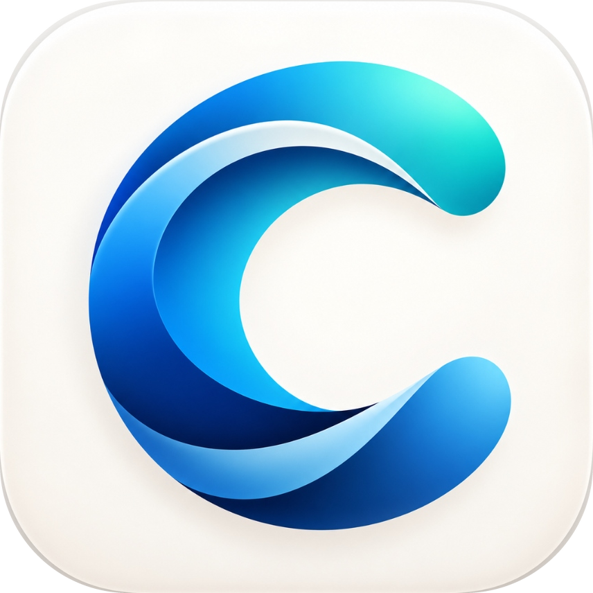

<div align="center">



# ClaudeBridge

**Use Claude Code with any LLM provider — GLM, DeepSeek, MiniMax, OpenRouter, and more.**

A local proxy that sits between Claude Code and non-Anthropic model providers, translating the Anthropic API to OpenAI-compatible endpoints on the fly.

[Features](#-features) · [Requirements](#-requirements) · [Windows](#-windows) · [macOS](#-macos) · [Build from source](#-building-the-exe-windows) · [Troubleshooting](#-troubleshooting) · [Contributing](#-contributing) · [License](#-license)

</div>

---

Claude Code is hard-coded to talk to the Anthropic API. ClaudeBridge intercepts that traffic locally and rewrites it into the OpenAI-compatible format that most third-party routers and providers already speak — so your existing subscriptions keep working, with auto-compaction, vision, key rotation, and failover layered on top.

Nothing leaves your machine except the request to your chosen provider. Your API keys are stored locally, never committed, never logged.

## ✨ Features

- **Multi-provider routing** — Dahl Global, OpenRouter, OpenCode Zen, Atria ASI, DeepSeek, or any OpenAI-compatible endpoint. Switch providers from the dropdown without restarting Claude Code.
- **Hybrid router with failover** — send heavy Sonnet/Opus traffic to a primary provider and cheaper Haiku/vision traffic to a secondary. Falls back to the secondary if the primary errors.
- **Multi-key rotation** — paste comma-separated API keys and Claude Bridge round-robins them, spreading load across accounts.
- **Real auto-compact keys** — detects each model's true context window and injects the correct `CLAUDE_CODE_AUTO_COMPACT_WINDOW` / `MAX_CONTEXT_TOKENS` values, so compaction actually fires on non-Claude models.
- **Image-to-disk bridge** — converts Anthropic `image` blocks to OpenAI `image_url` format and auto-saves embedded images to disk so vision works on providers that only accept URLs.
- **Model mapping** — map Sonnet, Opus, and Haiku roles to whichever models your provider offers. Claude Code keeps thinking it's talking to the real thing.
- **Thinking mode** — preserves `<thinking>` blocks as structured reasoning for models that support them.
- **System tray** — lives quietly in the tray; the proxy keeps running with the window closed.
- **Launch at login** — registers a Run key on Windows or a LaunchAgent on macOS, so the bridge is up whenever you are.
- **Dark UI** — single-window Tkinter app, no browser, no Electron, ~1 MB runtime.

## 📋 Requirements

- **Python 3.10+**
- A Claude Code installation (Claude Code CLI or the desktop app)
- An API key for any supported provider — see [Providers](#-providers)

## 🪟 Windows

### Option 1 — Run from source

```powershell
# 1. Clone
git clone https://github.com/abhimady2/claude-bridge.git
cd claude-bridge

# 2. Install dependencies
pip install -r requirements.txt

# 3. Launch
python claude_bridge_app.py
```

### Option 2 — Build the standalone EXE

```powershell
pip install pyinstaller
pyinstaller ClaudeBridge.spec
```

This produces `dist\ClaudeBridge.exe` — a single self-contained executable with the logo, icon, and all assets bundled. Distribute it anywhere; no Python installation needed.

The `.spec` file controls the build — icon, hidden imports (`pystray._win32`, `anthropic`, `PIL.ImageTk`), and asset bundling. Edit the spec rather than passing CLI flags.

## 🍎 macOS

macOS doesn't bundle Tkinter with the system Python, so install `python-tk` first:

```bash
# 1. Prerequisites
brew install python-tk
brew install python@3.12   # or any 3.10+

# 2. Clone
git clone https://github.com/abhimady2/claude-bridge.git
cd claude-bridge

# 3. Install dependencies
python3 -m pip install -r requirements.txt

# 4. Launch
python3 claude_bridge_app.py
```

### macOS notes

- **Config location:** `~/ClaudeBridge/config.json` (Windows: `%APPDATA%\ClaudeBridge`)
- **Launch at login:** writes a LaunchAgent to `~/Library/LaunchAgents/com.claudebridge.app.plist` — the same checkbox that uses the Run key on Windows. To manage manually, run `launchctl load|unload ~/Library/LaunchAgents/com.claudebridge.app.plist`.
- **Tray icon:** pystray renders in the macOS menu bar.
- **Window icon:** the `.ico` is a Windows format; macOS ignores it harmlessly.
- To build a `.app` bundle: `pyinstaller ClaudeBridge.spec` produces a windowed binary, though for a signed `.app` you'd wrap it with `py2app` and notarize it yourself — out of scope here.

## ⚡ Connecting Claude Code

Once the app is running, click **⚡ Configure Claude Code** in the toolbar. Claude Bridge writes `ANTHROPIC_BASE_URL`, your auth token, and the model mappings into `~/.claude/settings.json` (backing up the original first — **Restore Claude Settings** reverts it).

Or do it manually in `~/.claude/settings.json`:

```json
{
  "env": {
    "ANTHROPIC_BASE_URL": "http://localhost:4000",
    "ANTHROPIC_AUTH_TOKEN": "any-non-empty-string",
    "CLAUDE_CODE_USE_AUTH_TOKEN": "1"
  }
}
```

The default port is `4000`; if you change it in the app, use that port here instead.

**Check it works:** open a Claude Code project and run a prompt — the app's log column should light up with the translated request, and the tray icon dot turns green.

## 🔧 Providers

| Provider | Endpoint | Notes |
|---|---|---|
| Dahl Global | `inference.dahl.global/v1` | Default; DeepSeek-V4-Flash for Sonnet role |
| OpenRouter | `openrouter.ai/api/v1` | Route to 100+ models |
| OpenCode Zen | `opencode.ai/zen/v1` | Free tier available |
| Atria ASI | `api.atria-asi.ai/v1` | 128k context |
| DeepSeek | `platform.deepseek.com` | Direct, cheapest quality-per-token |

Add a custom provider via **+ New Provider** — any OpenAI-compatible `/v1/chat/completions` endpoint works.

### Model roles

Claude Code always asks for Sonnet/Opus/Haiku by role. Map each role to a model your provider serves:

| Claude Code role | Typical mapping |
|---|---|
| Sonnet (default) | `deepseek-ai/DeepSeek-V4-Flash-0731` |
| Opus (heavy tasks) | `MiniMaxAI/MiniMax-M2.7` |
| Haiku (fast/cheap) | `zai-org/GLM-5.3-Flash` |

### Multi-key rotation

Paste keys comma-separated in the API Key field:

```
sk-xxxxx,sk-yyyyy,sk-zzzzz
```

The pool indicator shows how many keys are loaded and which is active. The bridge round-robins per request.

### Hybrid routing

Enable **Hybrid Router** to split traffic by tier:

- **Primary** — Sonnet + Opus requests (heavy lifting)
- **Secondary** — Haiku + vision requests (cheap, fast)
- **Failback** — if the primary errors, retry on the secondary

## 🧠 How it works

```
Claude Code  ──Anthropic format──►  ClaudeBridge (localhost:4000)
                                          │
                                          ▼  translates:
                                     Anthropic → OpenAI
                                          │
                                     ┌──────┴──────┐
                                  primary          secondary
                                     │                │
                                  your provider(s)
```

- **Request translation** — `messages`, `system`, `tool_use`, `thinking`, and `max_tokens` (clamped to 65,536) converted to OpenAI schema; `max_tokens` is also clamped to the provider's known context window when detected.
- **Response translation** — OpenAI deltas streamed back as Anthropic SSE events, so Claude Code's streaming UX works unchanged.
- **Auto-compact injection** — looks up the target model's real context window and exports the matching env vars, fixing compaction on providers that report fake limits.
- **Vision** — Anthropic `image` blocks become `image_url` entries; base64 payloads are auto-saved to a temp folder and referenced by path for providers that reject inline images.
- **Fallback** — on a primary 4xx/5xx or connection failure, the hybrid router retries the request on the secondary before surfacing an error.

## 🛠 Troubleshooting

<details>
<summary><b>Claude Code says "connection refused"</b></summary>

The proxy isn't running, or the port doesn't match. Check the log column in the app — if it's empty, the proxy is stopped. Verify `ANTHROPIC_BASE_URL` in `~/.claude/settings.json` points at the port shown in the app (default 4000). Restart Claude Code after editing settings.
</details>

<details>
<summary><b>"Model not found" or 404 from provider</b></summary>

The model name doesn't exist on your provider. Open the provider profile and set each role (Sonnet/Opus/Haiku) to a model the provider actually serves — check your provider's model list.
</details>

<details>
<summary><b>Responses cut off mid-message</b></summary>

`max_tokens` is clamped to the model's context window. If the provider reports a smaller window than it actually supports, set `context_length` explicitly in the provider profile.
</details>

<details>
<summary><b>Auto-compaction never triggers</b></summary>

The provider's context window isn't detected. Claude Bridge falls back to a conservative default — set `context_length` manually in the provider profile so the correct `CLAUDE_CODE_AUTO_COMPACT_WINDOW` gets injected.
</details>

<details>
<summary><b>Images aren't reaching the model</b></summary>

The provider may reject inline base64. Claude Bridge auto-saves images to disk and passes file paths instead — check the log for the save path, or toggle the strip-images option in the provider profile.
</details>

<details>
<summary><b>macOS: <code>ModuleNotFoundError: Tkinter</code></b></summary>

Tkinter isn't bundled with macOS system Python. Run `brew install python-tk` and relaunch with the brew Python (`python3`), not `/usr/bin/python3`.
</details>

<details>
<summary><b>Windows: <code>pyinstaller</code> build fails</b></summary>

Ensure `pyinstaller` is installed in the same environment you're building from, and that `assets/` sits next to `ClaudeBridge.spec` — the spec bundles it by relative path. If the EXE is missing its icon, build from the repo root, not a subdirectory.
</details>

## 🤝 Contributing

PRs welcome. Keep it consistent with the existing style:

- **Lazy code** — read the flow end-to-end before changing it, then write the smallest diff that works. No speculative abstractions.
- **One check per non-trivial change** — add a `test_*.py` script that exits non-zero if the logic breaks. No framework needed.
- **Commit messages** — `subject: what changed` in the first line, the why in the body if it's non-obvious.

## 📄 License

MIT — see [LICENSE](LICENSE). © 2026 Abhishek. See [AUTHORS](#) if this ever grows beyond one person.

## ⚖️ Disclaimer

ClaudeBridge is an independent project and is not affiliated with or endorsed by Anthropic. It exists to let users route their own API traffic to providers of their choice. You are responsible for complying with the terms of service of Claude Code and your chosen provider.
